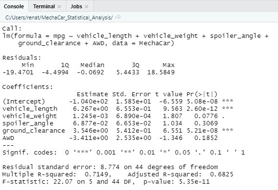
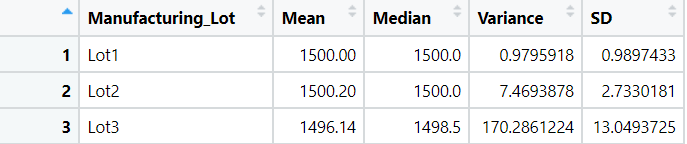
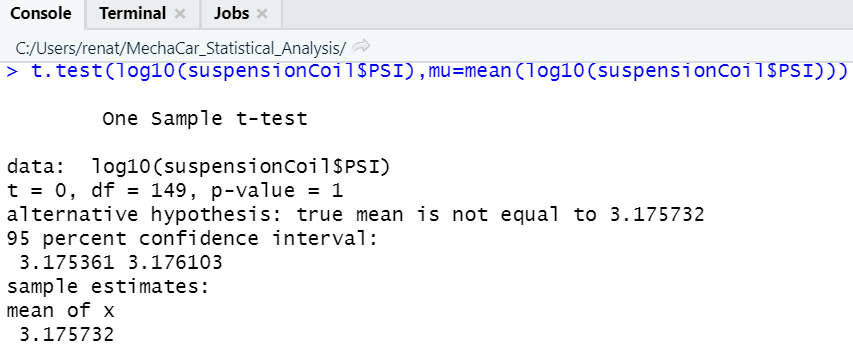
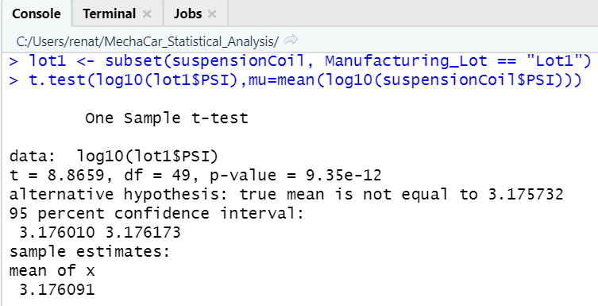
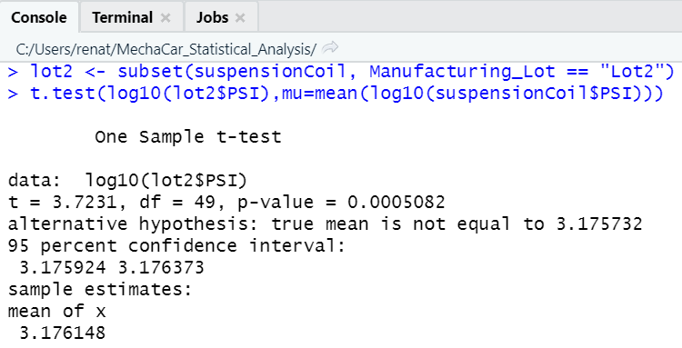
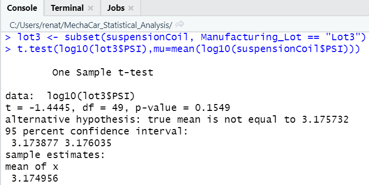

# MechaCar_Statistical_Analysis

## Linear Regression to Predict MPG
 
Output from the linear regression:
 

<ul>
<li>Vehicle length and ground clearance provided a non-random amount of variance to the mpg values in the dataset.
<li>The p-value is 5.35e-11, which is much smaller than the significance level (assuming a significance level of 0.05%). Therefore, we can state that there is sufficient evidence to reject the null hypothesis, which means that the slope of the linear model is not considered to be zero.
<li>The multiple r-squared value is 0.71, which means that roughly 71% of all predictions will be correct when using this linear model and each dependent value will not be determined by random chance and error.
<li>The adjusted r-squared value is 0.68, which means that roughly 68% of all predictions will be correct when using this linear model and each dependent value will not be determined by random chance and error.
<li>Based on these results, we can say that this linear model effectively predicts mpg of MechaCar prototypes. 
</ul>

## Summary Statistics on Suspension Coils
 
total_summary dataframe:
 

 
lot_summary dataframe:
 

 
The design specifications for the MechaCar suspension coils dictate that the variance of the suspension coils must not exceed 100 pounds per square inch. The current manufacturing data meets this design specification for all manufacturing lots in total, because the variance is 62.29. As for each lot individually, lots 1 and 2 meet this design specification (variances of 0.97 and 7.46, respectively), however, lot 3 does not meet because the variance is 170.28.

## T-Tests on Suspension Coils
 
Determine if the PSI across all manufacturing lots is statistically different from the population mean of 1,500 pounds per square inch: 
 

The p-value is 1. Assuming a significance level of 0.05 percent, the p-value is above the significance level. Therefore, we do not have sufficient evidence to reject the null hypothesis, and we can state that the PSI across all manufacturing lots is statistically similar from the population mean of 1,500 pounds per square inch. 
 
Determine if the PSI for each manufacturing lot is statistically different from the population mean of 1,500 pounds per square inch: 
 
Lot 1: The p-value is below the significance level of 0.05 percent, so we can reject the null hypothesis and state that the PSI for lot 1 is statistically different from the population mean of 1,500 pounds per square inch. 

 
Lot 2: The p-value is above the significance level of 0.05 percent, so we can state that the PSI for lot 2 is statistically similar to the population mean of 1,500 pounds per square inch. 

 
Lot 3: The p-value is above the significance level of 0.05 percent, so we can state that the PSI for lot 3 is statistically similar to the population mean of 1,500 pounds per square inch.